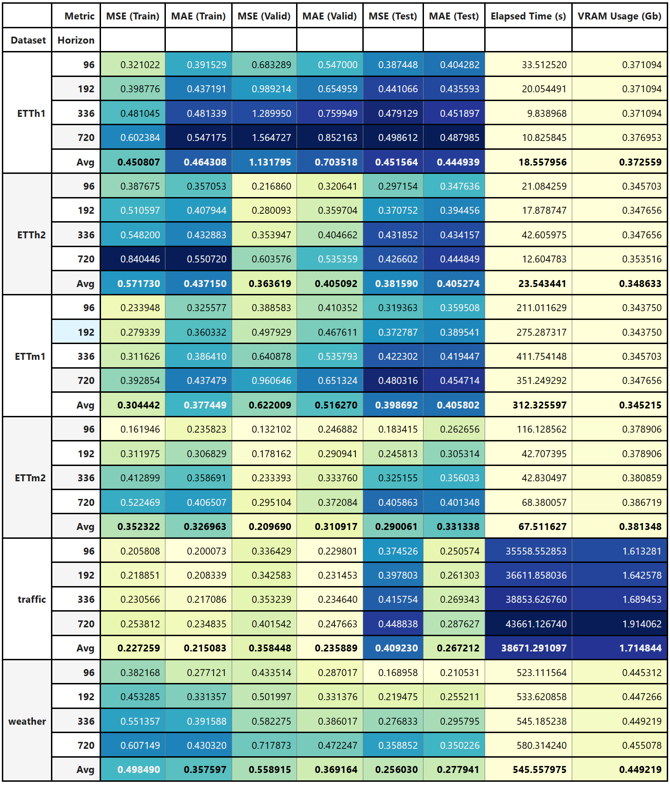
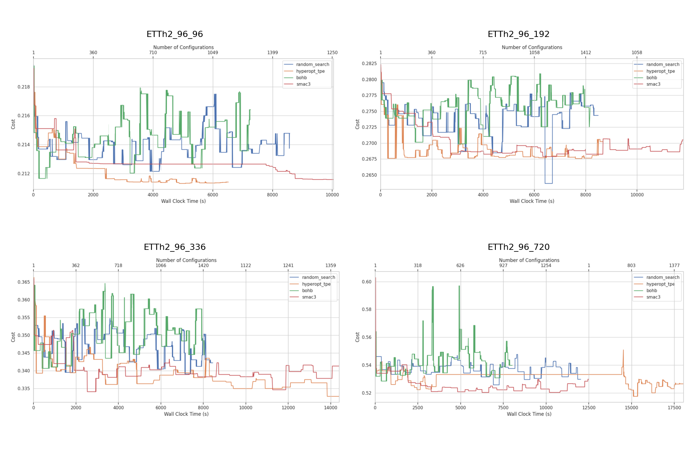
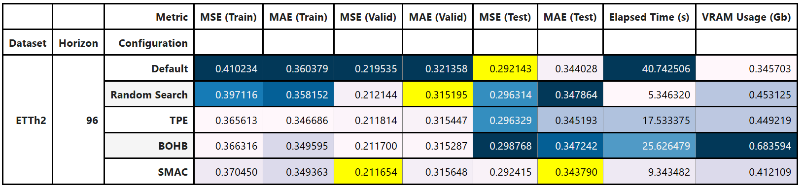
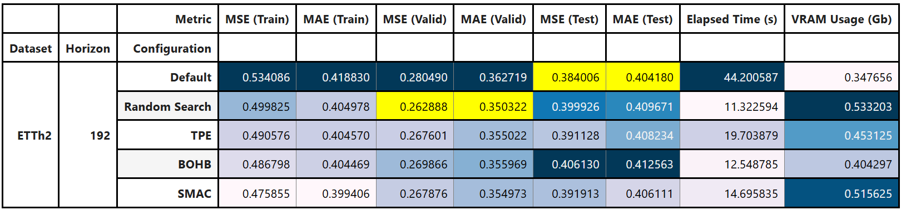
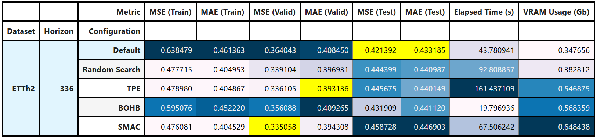
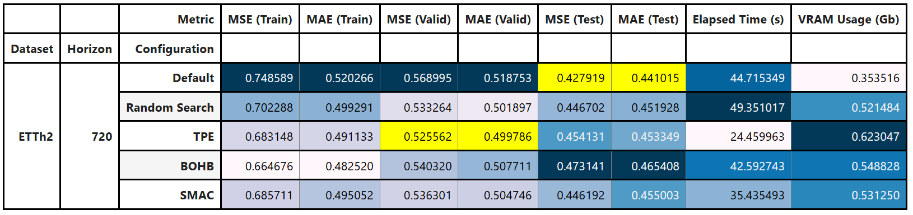

# **Hyperparameter Optimization for SOFTS architectures**

This repository is a fork of the official implementation of the Deep Neural Network [SOFTS: Efficient Multivariate Time Series Forecasting with Series-Core Fusion](https://arxiv.org/pdf/2404.14197.pdf) in PyTorch, a scalable pure MLP model that achieves state-of-the-art performance on multivariate time series forecasting benchmarks. Source code is modified in order to improve efficiency and compatiblity with 
the hyperparameter tunning utilities. Furthermore, several scripts are developed that implement the Hyperparameter Optimization process with raytune and smac libraries.

## Requirements

* Linux system (tested on Ubuntu 22.04+)
* NVIDIA-compatible GPU (tested with RTX 3090)

## Reproduciblity

To replicate the results obtained from the ETTh2 dataset, please follow these steps:

### Install conda environments

```{bash}
conda create -f conda_config_files/environment-raytune.yml
conda create -f conda_config_files/environment-smac.yml
```

### Download datasets

```{bash}
conda activate py3.11-timemixer-raytune
python3 download_data.py
conda deactivate
```
### Run main script

```{bash}
. runexpSOFTS-ETTh2.sh
```

#### Baseline Results (seed=2021)


#### Evolution of HPO algorithms (seed=123)


#### Performance comparison (seed=123)






## References

```
@article{han2024softs,
  title={SOFTS: Efficient Multivariate Time Series Forecasting with Series-Core Fusion},
  author={Han, Lu and Chen, Xu-Yang and Ye, Han-Jia and Zhan, De-Chuan},
  journal={arXiv preprint arXiv:2404.14197},
  year={2024}
}
```
