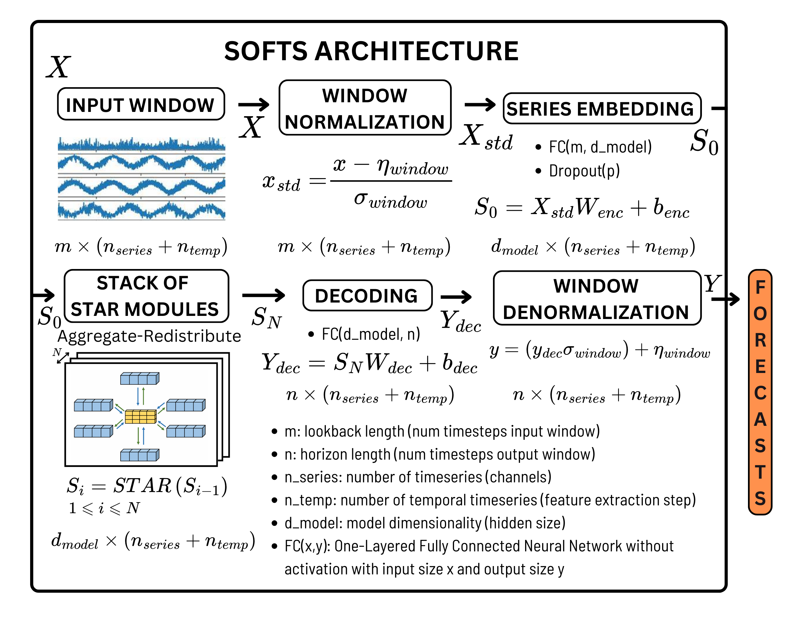
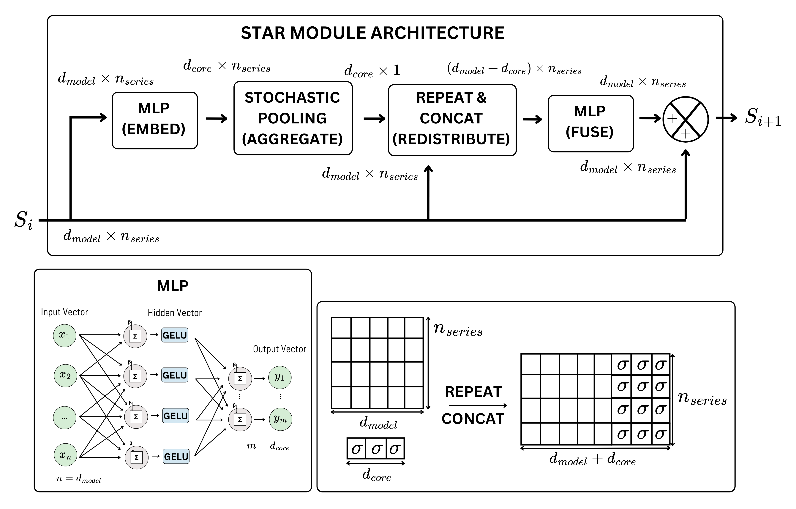

# **SOFTS-TFM**: Tunning the Hyperparameters of the Multivariate Time Series Forecasting Deep Neural Network SOFTS

[SOFTS-TFM](https://github.com/antmartinez47/SOFTS-TFM) is a forked version of the [official PyTorch implementation](https://github.com/Secilia-Cxy/SOFTS) of the Deep Neural Network [SOFTS](https://arxiv.org/pdf/2404.14197.pdf), a scalable pure-MLP model that achieves state-of-the-art performance on multivariate time series forecasting benchmarks (first published on arXiv on 22/04/2024). The primary motivation behind this repository is to build a robust Hyperparameter Optimization (HPO) pipeline for tuning the [SOFTS](https://arxiv.org/pdf/2404.14197.pdf) model's hyperparameters, aiming to improve the performance reported by the original authors for the task of (Multivariate) Time Series Forecasting (TSF). This initiative arose as part of the objectives set during the development of the Final Master's Thesis (TFM) for the Master's Degree in Data Science at the University of Valencia (*Máster en Ciencia de Datos, Escuela Técnica Superior de Ingeniería, Universidad de Valencia*).

The original source code has been modified, extended, and enhanced to improve efficiency and compatibility with the selected hyperparameter tuning utilities. [SOFTS-TFM](https://github.com/antmartinez47/SOFTS-TFM) provides several Python scripts and packages that implement the HPO routine using the [`raytune`](https://docs.ray.io/en/master/tune/index.html) and [`smac`](https://automl.github.io/SMAC3/main/) libraries, supporting a wide range of search algorithms (random search, Bayesian optimization, TPE, BOHB, etc.). The modifications maintain the coding style of the official implementation, utilizing `argparse` for user interaction via the Linux shell. This feature offers greater flexibility in designing customized HPO experiments and facilitates integration with similar architectures and tasks, as it allows users to specify the search space, search algorithm, tuning process variables, and other global parameters of the training process.

[SOFTS-TFM](https://github.com/antmartinez47/SOFTS-TFM) was used during the development of the TFM to generate the experimental results related to the [SOFTS](https://arxiv.org/pdf/2404.14197.pdf) architecture, including the reproduction of the results reported by the authors in the original paper and the HPO experiments with the ETTh2 dataset. By using `argparse` and the command line to execute MTSF training and tuning experiments, [SOFTS-TFM](https://github.com/antmartinez47/SOFTS-TFM) allows for direct optimization of any search space for [SOFTS](https://arxiv.org/pdf/2404.14197.pdf) hyperparameters, with support for probability distributions and conditional dependencies. Furthermore, thanks to its modular coding style, which preserves the syntax of the original implementation, [SOFTS-TFM](https://github.com/antmartinez47/SOFTS-TFM) can be easily adapted to work with different datasets, architectures, and tasks.



**Figure 1**: Overview of the [SOFTS](https://arxiv.org/pdf/2404.14197.pdf) Deep Neural Network. [SOFTS](https://arxiv.org/pdf/2404.14197.pdf) utilizes an MLP-based encoder-decoder architecture, where STAR blocks are applied sequentially to form the input for the decoder, which is subsequently used to generate the forecasts.

## **Table of Contents**

- [Requirements](#requirements)
- [Structure](#structure)
- [How to Use](#how-to-use)
- [SOFTS-ETTh2 Experiment](#softs-etth2-experiment)
- [References](#references)

## **Requirements**

* Linux (Ubuntu 22.04+)
* NVIDIA-compatible GPU (and drivers)
* miniconda3/anaconda3
* GCC compiler

## **Structure**

SOFTS-TFM is built on top of a fork of the official repository. The original files are preserved, with some minor alterations. Additionally, the following files and folders were specifically added to run and analyze training and tuning experiments for Time Series Forecasting (TSF) problems:

- `checkpoints`: CSV files summarizing the progress of the experiments.
- `conda_config_files`: YAML configuration files specifying the conda environments.
- `tfm_imgs`: Images used in the thesis to summarize the results obtained.
- `tfm_scripts`: Shell scripts and text logs of the experiments.
- `tfm_utils`: A Python package containing various modules specifically implemented for the TFM. These modules address different needs encountered during development, such as model checkpointing, early stopping callbacks, utilities for plotting the results of HPO experiments, and enhanced training and evaluation utilities extracted from the original implementation.
- `build_summary_imgs.ipynb`: A Jupyter notebook used to create dataframes for comparing default and optimized configurations, and to verify the correct reproduction of the paper’s results.
- `download_data.py`: Downloads and extracts datasets used in the paper’s benchmarks and TFM experiments.
- **`plot_tune_results.py`**: Generates plots representing the progress and summary of the HPO experiments.
- **`smac_softs.py`**: Executes an HPO experiment on SOFTS using the SMAC package.
- **`train_softs.py`**: Trains a SOFTS model.
- **`tune_softs.py`**: Runs an HPO experiment on SOFTS using the Ray Tune package.
- `SOFTS-ETTh2.sh`: Runs all scripts used to generate the results presented in the TFM, enabling full reproduction of the SOFTS-ETTh2 experiment.

The files marked in **bold** utilize `argparse`, allowing users to adapt their behavior to specific problems. Furthermore, all functions and modules of these new files are well-documented to help users easily adapt and expand the code for their own use cases.

## **How to use**

Clone [SOFTS-TFM](https://github.com/antmartinez47/SOFTS-TFM) repository in the current working directory:

```bash
git clone https://github.com/antmartinez47/SOFTS-TFM
cd SOFTS-TFM
```

Install conda environments:

```bash
conda create -f conda_config_files/environment-raytune.yml
conda create -f conda_config_files/environment-smac.yml
```

SOFTS-TFM is designed to be used as an extension of the original repository, maintaining the same `argparse` style for user interaction. Scripts are invoked through a shell, with arguments passed using the `--argument value` syntax. 

To train a SOFTS model, the dataset must meet several requirements. In particular, it should be a single CSV file where each column contains a time series, along with an additional column named *date* for the timestamps.

The following is an example of using SOFTS-TFM to train a SOFTS model for the task of Multivariate Time Series Forecasting on the ETTh2 dataset (7 time series):

```bash
conda activate py3.11-softs-raytune
python3 download_data.py # Download and extract datasets
python3 train_softs \
    --data ETTh2 --root_path ./dataset/ETT-small/ --data_path ETTh2.csv --features M \
    --save_dir ./checkpoints/baseline/ETTh2_96_192 --seq_len 96 --pred_len 192 \
    --enc_in 7 --dec_in 7 --c_out 7 --d_model 128 --d_core 64 --e_layers 2 \
    --d_ff 128 --dropout 0.0 --num_workers 4 --train_epochs 20 --batch_size 32 --train_prop 1.0 \
    --patience 3 --delta 0.0 --learning_rate 3e-4 --loss MSE --lradj cosine --seed 123;
```

* Dataset location: ./dataset/ETT-small/ETTh2.csv `--root_path ./dataset/ETT-small/` `--data_path ETTh2.csv`
* Type of forecasting: M (Multivariate) `--features M`
* Checkpoints directory: ./checkpoints/baseline/ETTh2_96_192 `--save_dir ./checkpoints/baseline/ETTh2_96_192`
* Num timesteps input window (lookback length): 96 `--seq_len 96`
* Num timesteps output window (horizon length): 192 `--pred_len 192`
* Num input channels encoder (depth of $S_0$ in figure 1): 7 `--enc_in 7`
* Num input channels decoder (depth of $S_N$ in figure 1): 7 `--dec_in 7`
* Num output channels (time series): 7 `--c_out 7`
* Hidden size of STAR blocks (model dimension): 128 `--d_model 128`
* Size of core series representation (core dimension): 64 `--d_core 64`
* Number of STAR blocks: 2 `--e_layers 2`
* Hidden size of MLP modules (feed forward dimension): 128 `--d_ff 128`
* Dropout rate: 0.0 `--dropout 0.0`
* Number of workers for multithreading during data loading: 1 `--num_workers 4`
* Number of maximum training epochs: 20 `--training_epochs 20`
* Batch size: 32 `--batch_size 32`
* Proportion of training set that is used to optimize model weights: 1.0 `--train_prop 1.0`
* Patience for Early Stopping callback: 3 `--patience 3`
* Delta for Early Stopping callback: 0.0 `--delta 0.0`
* Initial learning rate of Adam optimizer: 3e-4 `--learning_rate 3e-4`
* Loss function: MSE (Mean Squared Error) `--loss MSE`
* Learning Rate Scheduler: Cosine scheduler `--lradj cosine`
* Random seed: 123 `--seed 123`

And the following block of code tunes the hyperparameters of SOFTS for the task of MTSF on the ETTh2 dataset:

```bash
conda activate py3.11-softs-raytune
python3 tune_softs \
    --data ETTh2 --root_path ./dataset/ETT-small/ --data_path ETTh2.csv --features M \
    --seq_len 96 --pred_len 192 --enc_in 7 --dec_in 7 --train_epochs 20 --patience 3 \
    --train_prop 1.0 --loss MSE --num_workers 1 --gpu 0 --tune_search_algorithm hyperopt_tpe \
    --tune_hyperopt_n_initial_points 150 --tune_hyperopt_gamma 0.25 \
    --tune_storage_path ./checkpoints/hptunning/hyperopt_tpe --tune_experiment_name ETTh2_96_192 \
    --tune_num_samples 1500 --tune_max_trial_time_s 60 --tune_time_budget_s 14400 \
    --tune_max_concurrent 4 --tune_gpu_resources 0.5 --tune_cpu_resources 1 \
    --tune_search_space "{ \
        \"batch_size\": [\"choice\", [8, 16, 32, 64, 128]], \
        \"learning_rate\": [\"loguniform\", [0.00005, 0.005]], \
        \"d_model\": [\"choice\", [32, 64, 128, 256 512]], \
        \"alpha_d_ff\": [\"choice\", [1, 2, 3, 4]], \
        \"d_core\": [\"choice\", [32, 64, 128, 256 512]], \
        \"e_layers\": [\"choice\", [1, 2, 3, 4]], \
        \"dropout\": [\"loguniform\", [0.0008, 0.12]], \
        \"lradj\": [\"choice\", [\"cosine\", \"type1\"]] \
    }" \
   --seed 123;
```


* Search algorithm: Tree-structured Parzen Estimators (Hyperopt implementation) `--tune_search_algorithm hyperopt_tpe`
* Configuration of the search algorithm: `--tune_hyperopt_n_initial_points 150` `--tune_hyperopt_gamma 0.25`
* Raytune checkpoints and logs save directory: ./checkpoints/hptunning/hyperopt_tpe/ETTh2_96_192 `--tune_storage_path ./checkpoints/hptunning/hyperopt_tpe` `--tune_experiment_name ETTh2_96_192`
* Maximum num of configurations: 1500 (training stops after reaching this value) `--tune_num_samples 1500`
* Stopping conditions:
  * Global condition: Tuning stops after reaching 14400 seconds (6 hours) `tune_time_budget_s 14400`
  * Local condition: Trial evaluation stops after reaching 60 seconds `tune_max_trial_time_s 60`
* Maximum concurrent trials (single GPU setting is assumed): 4 `--tune_max_concurrent 4` `--tune_gpu_resources 0.5` `--tune_cpu_resources 1`
* A Search space (`--tune_search_space`) consisting on the following hyperparameters (every argument of tune_softs.py can be tuned):
  * Batch size: categorical distribution with values [8, 16, 32, 64, 128]
  * Learning rate: Loguniform distribution in the range [0.00005, 0.005]
  * STAR block hidden size (*d_model*): categorical distribution with values [32, 64, 128, 256 512]
  * MLP hidden size as a multiple of *d_model* (*alpha_d_ff*): categorical distribution with values [1, 2, 3, 4]
  * Size of core series representation (*d_core*): categorical distribution with values [32, 64, 128, 256 512]
  * Number of STAR blocks (*e_layers*): categorical distribution with values [1, 2, 3, 4]
  * Dropout rate: loguniform distribution in the range values [0.0008, 0.12]
  * Learning Rate Scheduler (*lradj*): categorical distribution with values [cosine, type1]
* Random Seed (acts as initial seed for both the global tunning process and the local config evaluation process): 123 `seed 123`

This command tunes SOFTS model’s hyperparameters by using the Hyperopt TPE search algorithm. The script allows for specifying key factors related to the HPO experiment configuration like the search space, the number of samples, resource allocation (GPU and CPU), and a time budget for tuning, enabling efficient exploration of various model configurations. 

In both cases, the script arguments that are not specified take the default value as given by their documentation (which you can print by running the command `python3 tune_softs.py --help`)

## **SOFTS-ETTh2 experiment**

To replicate the results of the `SOFTS-ETTh2` experiment (SOFTS architecture with the ETTh2 dataset) presented in the TFM, run the following command. 

```{bash}
. SOFTS-ETTh2.sh
```

The script `SOFTS-ETTh2` contains all the instructions required to obtain the results reported in the Final Master's Project for the `SOFTS-ETTh2` experiment (full reproducibility), from baseline evaluation to hyperparameter tunning, plot generation and comparative analysis. Runtime is approximately 2 GPU days on an Nvidia RTX 3090, with the following parallelization scheme for a single GPU: 4 concurrent trials for random search, TPE, and BOHB algorithms, and 1 concurrent trial for the SMAC algorithm.


**Figure 2**: Error metrics of SOFTS on the ETTh1, ETTh2, ETTm1, ETTm2, Traffic, and Weather datasets. The source code was built on top of the official SOFTS implementation, with modifications aimed at improving efficiency and flexibility. Hyperparameters (including the random seed) were set according to the values specified in the SOFTS paper to reproduce the reported results.


**Figure 3**: Evolution of each hyperparameter tuning session conducted on SOFTS with the ETTh2 dataset. The horizontal axis represents wall clock time in seconds and the number of configurations evaluated, while the vertical axis represents the objective cost of the tuning session, in this case, the best validation loss observed across the entire learning curve (seed=123)


**Figure 4**: Comparison between the default hyperparameters and the best configuration found by the set of algorithms considered, for each forecast horizon. The lowest values are highlighted in yellow, indicating the best configuration for each particular metric (seed=123)

## References

```
@article{han2024softs,
  title={SOFTS: Efficient Multivariate Time Series Forecasting with Series-Core Fusion},
  author={Han, Lu and Chen, Xu-Yang and Ye, Han-Jia and Zhan, De-Chuan},
  journal={arXiv preprint arXiv:2404.14197},
  year={2024}
}
@article{liaw2018tune,
  title={Tune: A Research Platform for Distributed Model Selection and Training},
  author={Liaw, Richard and Liang, Eric and Nishihara, Robert and Moritz, Philipp and Gonzalez, Joseph E and Stoica, Ion},
  journal={arXiv preprint arXiv:1807.05118},
  year={2018}
}
@article{lindauer2021smac3,
  title={SMAC3: A Versatile Bayesian Optimization Package for Hyperparameter Optimization},
  author={Lindauer, Marius and Eggensperger, Katharina and Feurer, Matthias and Biedenkapp, André and Deng, Difan and Benjamins, Carolin and Ruhkopf, Tim and Sass, René and Hutter, Frank},
  journal={arXiv preprint arXiv:2109.09831},
  year={2021}
}
```
